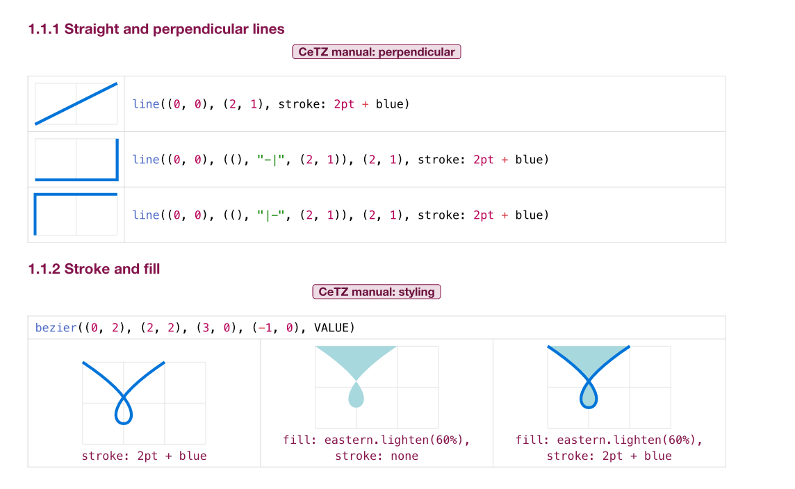

# Visual CeTZ

[View as PDF](https://romeov.github.io/VisualCeTZ/visual-cetz.pdf). [View as HTML](https://romeov.github.io/VisualCeTZ/).

See also the [CeTZ Gallery](https://romeov.github.io/CeTZGallery/), complete diagrams that put these techniques to work.

One picture per command or parameter for [CeTZ](https://cetz-package.github.io/) 0.5.2, the drawing package for [Typst](https://typst.app/).

This is an adaptation of Jean Pierre Casteleyn's fantastic [_Visual TikZ_](https://ctan.org/pkg/visualtikz) ([PDF](https://mirrors.ctan.org/info/visualtikz/VisualTikZ.pdf), LPPL 1.3), which does the same for TikZ.
Its structure, section order, and choice of examples shaped every chapter here. The CeTZ code and pictures are new.
Features that CeTZ does not have are marked _Not in CeTZ_, with the closest replacement.

Every picture is rendered from the code printed next to it, and every section links to its page in the CeTZ manual:



## Build

With Typst 0.15 or later:

```sh
./build.sh
```

This writes `docs/visual-cetz.pdf`, `docs/index.html`, and one PNG per page in `docs/pages/` (the contents are on pages 1 and 2), which GitHub Pages serves. The HTML export uses Typst's experimental `html` feature.

## License

MIT for this adaptation; see [LICENSE](LICENSE). _Visual TikZ_ itself is under the LaTeX Project Public License 1.3.
